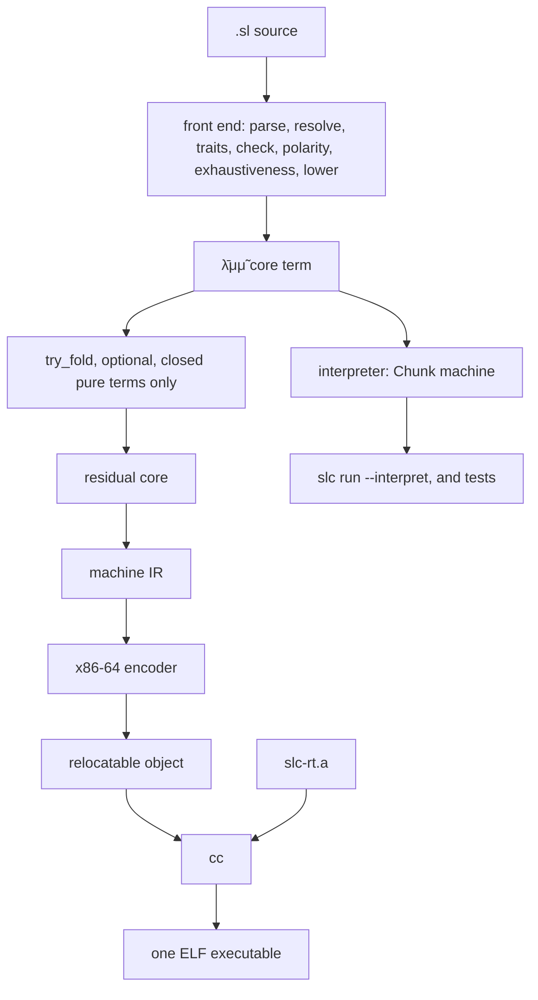
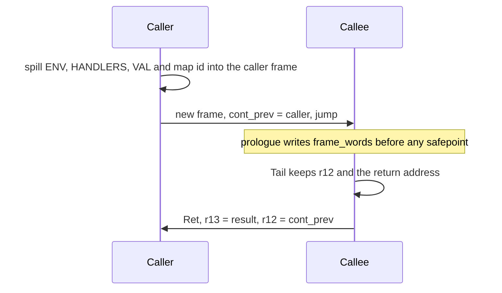
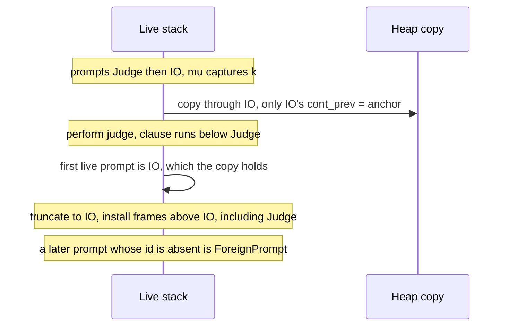

# SLC native compiler and runtime

Author: TBD
Date: 2026-09-27
Status: Draft

This is an implementation design for the compiler backend and the runtime it
links. It is not a change to the surface language. Observable behaviour stays
that of [docs/design/core.md](../../docs/design/core.md): multi-shot `mu`,
prompt identity, `ForeignPrompt`, `Forward`, and constant-space tail cuts.
What changes is the mechanism. The reference-counted conses in §11 Execution
are an interpreter detail. When this backend is the default for `slc run`,
that description is replaced by the protocol below. Until that pull request,
`core.md` still describes the interpreter, and this note is the
implementation design.

The product is two pieces that share one ABI.

1. A native compiler. The front end stays: parse, type, polarity,
   exhaustiveness, lowering to the λ̄μμ̃ core (`crates/slc-syntax`,
   `crates/slc-check`, `crates/slc-core`). A new lowering after the core
   emits native code. The first target is the host: x86-64, System V, one
   ELF executable. An internal machine IR is the compiler's last IR before
   encoding. It is not a shipped bytecode, and it is not an interpreter.
   The x86-64 encoder is replaceable later. The ABI is not.
2. A runtime, written in Rust, built as a static library and linked with
   `cc`. It owns the SLC stack buffer, continuation capture and installation,
   a precise mark-sweep collector, safepoints, and the primitive operations
   that are not compiled inline: checked arithmetic and `Into`, `exit`, `IO`,
   and `Fs`.

The reference-counted abstract machine in `crates/slc-runtime`
(`machine.rs`, `eval.rs`, `value.rs`, `chunk.rs`, `compile.rs`) stays
permanently. No pull request deletes it.

## Overview

Today `slc run` lowers a whole program to one `Chunk` and interprets it.
The continuation is an `Rc` cons (`Kont` in `crates/slc-runtime/src/machine.rs`),
environments are `Rc` conses (`Env` in `value.rs`), and integers are unboxed
`Value::Int(i64)`. Capture is a refcount bump. That is cheap, and it leaks a
cycle: `examples/duality/classical.sl` builds one, because the consumer
inside `Choice::Refutes` closes over the continuation that receives that
`Choice`.

The native path keeps the same front end and the same core terms, then
compiles those terms to x86-64. Generated SLC code jumps to generated SLC
code. It calls the runtime with an ordinary C call. `%rsp` is only the C
stack. The SLC stack is a heap buffer; its pointer is a reserved register.
At every safepoint the protocol roots sit in known slots of that buffer, and
a stack map says which other slots are pointers. The collector is precise
mark-sweep over those roots, the slots the map names, and the constant pool.
It is not Boehm. Gauche needs Boehm because the C heap is untyped; this
compiler emits the maps.

Gauche (Shiro Kawai, "Efficient floating-point number handling for
dynamically typed scripting languages", DLS 2008, §3.1, and the later
prompt-marker frames in the Gauche VM) is the prior art for the frame
protocol: a call pushes a continuation frame, a tail call slides arguments
over the current frame, a closure copies its environment to the heap, and a
captured continuation copies a slice of frames. It is not the prior art for
the instruction set. There is no bytecode milestone.

The interpreter remains the behavioural oracle and the compile-time
evaluator for closed terms. `slc-core::reduce` is not that evaluator. Its μ
rule returns the body without substituting the co-term
(`crates/slc-core/src/reduce.rs`, the arm on `Term::Mu`). Folding needs the
full machine, which already implements delays, handlers, prompts, and
match.



The interpreter is also a direct evaluator of the core, through the chunk,
for the oracle and for `try_fold`. It does not sit on the path that emits
instructions.

## Background and motivation

The acceptance suite runs the corrected runtime
(`PLAN.md`). `slc check` is parse, resolve, trait elaboration, type,
polarity, exhaustiveness, effect rows, and lowering
(`crates/slc-driver/src/main.rs`, `compile_file`). `slc run` then compiles
that core to one chunk (`compile::compile_program`), installs globals, and
applies `main` to unit and to `EXIT` under the runtime `IO` handler
(`run_program`, `apply_under_io`).

That machine is the right oracle and a poor product compiler.

- Capture is O(1) only because frames are refcounted conses. A continuation
  that points at a closure that points back is never freed. `lem` is that
  cycle (`docs/design/core.md` §11 Classical control,
  `examples/duality/classical.sl`).
- `Env::local` clones the `Value`. A `String` is an owned `String`, and a
  `Map` is an owned tree of `Value`s, so a lookup copies the tree
  (`value.rs`). The library maps and arrays are ordinary SLC data
  (`crates/slc-driver/src/stdlib/map.sl`, `array.sl`, `hashmap.sl`), not
  builtins. They should move by pointer.
- The driver starts the interpreter on a 256 MiB thread because the host
  stack was the continuation (`main.rs`, the `stack_size(256 * 1024 * 1024)`
  spawn). The continuation is now data, but the host stack is still the
  wrong place for it: a captured continuation must outlive the frame that
  built it, and a runtime written in Rust cannot scan an untyped C stack.
- Match that the core cannot express goes through `__match_dispatch`
  (`lower.rs`, `matching.rs`). The interpreter tries each arm from the
  outside. A native runtime that exports that search would keep a second
  pattern engine in the product. The native compiler builds the decision
  tree in the match section instead.

The language rules that the backend must not reopen are already fixed.
`A -> B` and `B <- A` are different types
(`docs/design/polarity.md`, `docs/design-notes/structural-adapters.md`).
Call-by-name is `λ$delay`, re-run on every demand, under the handlers of the
demand (`polarity.md`, "When a `let` computes"). A jump that meets a prompt
its captured stack does not hold is `ForeignPrompt`
(`control.md` §6, `EvalError::ForeignPrompt` in `eval.rs`). `--fuel N` turns
divergence into an error (`core.md` §11, `PLAN.md`). The REPL is deferred
and is not this work (`PLAN.md`, "Deferred"). Sections are flattened before
checking (`resolve.rs`); the compilation unit is the whole program. Traits
are elaborated and resolved before lowering (`traits.rs`, `check_program`);
this backend never sees an impl.

## Goals and non-goals

### Goals

- One ELF for one program, x86-64 System V, linked against the Rust runtime
  with `cc`.
- The frame protocol below, shared by generated code and `slc-rt`, stable
  enough that the encoder can be replaced without a new ABI.
- Both kinds of `of` compiled to code. A shape cut is a switch on the
  label. An order-sensitive match is a decision tree whose clauses stay in
  source order. No `__match_dispatch` symbol in the native runtime.
- The interpreter still builds, still passes its tests, and remains
  reachable for differential runs and for `try_fold`.
- Programs that pass today still pass: `examples/basics`,
  `examples/duality/classical.sl`, `examples/effects`, and the complete
  programs `crates/slc-driver/tests/design_programs.rs` extracts from
  `DESIGN.md` and `docs/design/`.
- A tail resumption inside a loop does not grow the SLC stack. A
  continuation captured under an inner prompt returns to that prompt. A
  continuation cycle is collected. A literal match with a default agrees
  with the interpreter.

### Non-goals

- A REPL, and any change to what a continuation means across entries.
- Call-by-need, memoized thunks, or a cache slot on a delay.
- Separate compilation, object-file ABIs between SLC modules, or a dynamic
  loader.
- Any target other than the host x86-64 System V ELF.
- Extending the core proof. Subject reduction of the calculus is
  [`proof/Slc/Core.lean`](../../proof/Slc/Core.lean). This backend does not
  re-prove it for the machine or the ELF.
- Surface syntax changes, new primitives, or orientation adapters. `A -> B`
  is not rewritten to `B <- A` or the reverse, anywhere in this backend.
- A bytecode interpreter, a bytecode milestone, or shipping the machine IR.
- Boehm, tagged integers, using the C stack as the continuation, or LLVM as
  the first encoder.
- Incremental or concurrent collection. The first collector stops at
  safepoints and sweeps.
- DWARF. Runtime diagnostics stay the interpreter's strings.
- Finalizers. A `File` id is an integer into a runtime table, as
  `Value::File` is today; the collector does not close it.

## Key Decisions

1. **The interpreter stays.** It is the oracle and the folder. `machine.rs`
   is not a prototype. After `slc run` defaults to the ELF, `slc run
   --interpret` still runs the chunk machine, because the driver's prelude,
   dictionaries, and `main` application already live in `run_program`. An
   internal-only switch would duplicate that path in every differential
   test. Folding does not use the flag; it calls `try_fold`.
2. **Match is compiled.** The native runtime does not export
   `__match_dispatch` and does not contain `matching.rs`. Shape matches
   are the one-column decision tree: a switch on the label. Order-sensitive
   matches are the same matrix, with clauses kept in source order and each
   position tested at most once on a path. The interpreter keeps
   `__match_dispatch`, and still tries arms from the outside, for the oracle
   and for terms the folder runs.
3. **Unboxed integers, no tag bit, whole-program monomorphization.** A word
   is an `i64`, an `f64` (and an `f32`, which the interpreter stores as
   `Value::Float(f64)`), a `char` scalar, or a pointer. Pointer-ness is a
   property of a specialization, not of a shared generic body. `Term` carries
   no types and no spans, so each instantiation is lowered as its own copy,
   with the substituted binder types in a side table. A use calls that copy.
   `u64`
   still stops at `i64::MAX` (`integer_destination`). Checked `i64`
   arithmetic is one encoding: a machine flag and `slc_rt_fail`. It is not
   also a runtime `slc_rt_add`.
4. **Precise mark-sweep, not Boehm and not refcounting.** Every stack frame
   and every heap object carries a `map_id`. The collector reads that id.
   It does not guess from a tag, and it does not scan the C stack.
   Refcounting is rejected because `lem` cycles.
5. **The SLC stack is a heap buffer that is never realloc'd in place.**
   Overflow allocates a new segment, copies live frames, and rewrites every
   interior pointer: `cont_prev`, `handler_prev`, spilled `HANDLERS`, and
   `r12` / `r15` / `rbx` when they point into the old segment. Heap pointers
   are not rewritten. The C stack is not the continuation.
6. **A `mu` that escapes copies through the outermost prompt.** The copy
   keeps every prompt id on that chain. Only the outermost frame's
   `cont_prev` is the anchor `slc_rt_prompt_anchor`, never null. Invoke
   walks the live stack as `Kont::jump` does: the first live prompt decides,
   a missing id is `ForeignPrompt` and writes nothing, and a hit truncates
   the live frames above that prompt before installing the copy. A prompt
   installed after the capture is not skipped. Non-escaping `μ` (`__call`,
   `let`, block returns) are not heap captures.
7. **Delays store code and environment only.** There is no saved handler and
   no memo cell. Entry uses the `HANDLERS` of the demand. Call-by-need would
   be an ABI change, and it is out of scope.
8. **One frame invariant.** `r12` is the current frame. `r15` is only the
   word at `[r12+8]`, the frame to return to. Caller-restore slots (return
   address, `cont_prev`) are not the callee's safepoint spills (`ENV`,
   `HANDLERS`, `VAL`). The map id in a frame describes that frame. A tail
   call keeps `r12` and the return address and replaces `ENV`, the slots,
   the map id, and `frame_words`.
9. **`try_fold` evaluates a core `Term` on an environment that has had
   `install_stdlib` applied.** It is not `slc-core::reduce`, and it is not
   a partial evaluator. A builtin name is not an open variable. A prelude
   function such as `add` is. Effectful terms, terms that are still open
   after that, and captured continuations stay residual. The call does not
   panic: `checked_neg` lands with it, and a panic is `Residual`.
10. **One argument word per group, and no orientation adapter.** Both
    arrows lower to `λ` (`lower.rs`, `bind_names`). The difference the
    backend preserves is the one lowering already made: what is placed in
    `VAL`, and whether a nullary negative function is applied at all. This
    backend does not insert a conversion between `->` and `<-`.

## Proposed design

### Crates

| Crate | Role |
|---|---|
| `slc-syntax`, `slc-check`, `slc-core` | Front end unchanged at the surface. The checker records the solved instantiation at each use so lowering can emit one specialized copy. The core `Term` does not grow types or spans. |
| `slc-runtime` | The interpreter. Gains `fold::try_fold`. `__neg` of `i64::MIN` becomes `checked_neg`. Loses nothing else. |
| `slc-abi` | Layout constants, stack-map schema, runtime symbol names. No codegen, no heap. Both sides depend on it. |
| `slc-rt` | The runtime static library (`crate-type = ["lib", "staticlib"]`). Depends only on `slc-abi`. |
| `slc-native` | Core to machine IR to x86-64. Calls `try_fold`. Does not link. |
| `slc-driver` | After the last slice, `slc run` emits an object, links it with `cc`, and execs the ELF. `--interpret` keeps today's path. |

`slc-rt` does not depend on `slc-runtime` or `slc-core`. The two heaps do
not share objects. A folded value is re-embedded as a core constant and then
as a machine immediate or a constant-pool descriptor. Interpreter `Value`s
are never passed into the native heap.

The language is single-threaded. One stack segment list, one heap, one fuel
counter. `slc-rt` is not `Sync`.

### Pipeline

`compile_file` is unchanged through checking. `Term`
(`crates/slc-core/src/term.rs`) has no types and no spans. `Env::expr_types`
is a `HashMap<Span, Type>`, and `lookup_instantiated` only copies a scheme
onto fresh variables; it does not record the substitution a use solved.
Joining that map to a term after `lower_program` cannot say whether `x` in
`id`'s `λx. x` is an `i64` or a `String`. Specialization therefore happens
before or during lowering, not on one shared core body.

`id` in `examples/basics/polymorphism.sl` is called on an `i64` and on a
`String`, and `Maybe::Just(T)` is one payload path in the source. A single
`pointer_slots` list at one code address cannot both trace and not trace
that slot. The backend does not compile that shared body, and it does not
store it in one global slot.

The checker records, at each use and after unification, the declaration and
the type arguments that use solved. That record is new. It is not
`lookup_instantiated`, and it is not `expr_types` alone. For each reachable
pair the lowerer runs on a copy of the surface declaration and fills a side
table as it binds:

```rust
struct Specialized {
    symbol: String,                 // "id$i64", never the template name "id"
    term: Term,                     // still untyped; the core grammar does not grow a type
    binders: Vec<(String, Type)>,   // substituted types, in the order lower.rs binds
}
```

The stack map is computed from `binders`, not from a span recovered after
the fact. `id$i64` and `id$String` are different addresses. A use lowers to
a reference to that symbol. It does not lower to `Var("id")`, and startup
does not evaluate the unspecialized root into one closure. `Maybe::Just` is
one specialization per payload shape; the object stores that shape's
`map_id`. `Maybe::Nothing` is one shared unit-payload `Tagged` object, the
same shape startup installs for every nullary variant: the payload word at
offset 24 is the immortal `slc_rt_unit`, and `map_id` is `MAP_EMPTY` because
that word is not a traced heap pointer. That is why `let nothing =
Maybe::Nothing` can be passed at three types. A nullary variant does not
carry `T`.

The worklist is the instantiations reachable from the program, including
instantiations discovered in a specialized body. If it exceeds 1024 entries
it is a compile error, `monomorphization did not converge`. That is a
compiler limit, not a new language rule. No emitted body still contains a
type variable. Boxing an `i64` at a generic boundary is rejected: it would
make the integer word a pointer inside `id` and `Just`, which is the tag
bit by another name.

`slc-native`'s other inputs are the ones `run_program` uses: the AST, for
`Decl::Effect` operations and enum variants (lowering skips `Decl::Effect`),
and `TraitInfo`, for the dictionary globals built after roots. Non-generic
lowered roots are still the terms step 4 evaluates.

The backend does not compile the `Chunk`. The chunk is the interpreter's
instruction stream. A core binder becomes a frame slot or an environment
slot. The observable is which name receives which value, not the
interpreter's "last component is de Bruijn 0" order (`bind_components`).

A non-generic global that is free in a function is loaded from its one slot
at the use, not copied when the closure is built, so a later `def` is
visible. That matches `Dynamic` lookup. A generic declaration is not that
slot. Locals are copied into a flat `Env`. The `Env` object's `map_id` is
the bitmap of that capture, not "every word is a pointer".

Startup follows `run_program`, in this order, and not "evaluate the term
vector, then `main`":

1. Install each name in `install_stdlib` as a stub closure (code pointer,
   arity, captured prefix). There is no `Builtin` or `PartialBuiltin` tag.
   A partial application returns an ordinary closure, which is what
   `builtin_step` does when `args.len() < arity`. Fully applied builtins
   lower to the encoding in the symbol table below. `__match_dispatch` is
   not installed in the native table.
2. Install `Value::Operation` globals from `Decl::Effect`, before any root
   runs.
3. Install each enum variant as a unit-payload `Tagged` global, again before
   roots. Lowering also emits those variants as roots; evaluating the root
   replaces the preinstalled value with the same tagged unit, as the driver
   does.
4. Evaluate non-generic, non-`main` roots in declaration order, each into
   one slot of one type. Do not evaluate an unspecialized generic such as
   `id` into a slot. Each specialization that is used as a value is a
   closure installed under its own symbol (`id$i64`), with that copy's code
   pointer. A direct call does not load a slot.
5. Build `__dict_{trait}_{key}` tuples from `TraitInfo` by lookup of the
   mangled impls (`dict_global_name`). Dictionaries are not in the term
   vector. A dictionary is monomorphic; it is one slot.
6. Under the `IO` prompt, apply `main` to unit, then to `EXIT`.

A non-generic global slot is either a scalar word in a non-scanned table or
a pointer in a scanned table. It has one type. A generic template has no
slot.

### Machine IR

The machine IR is a control-flow graph. Protocol registers are pinned.
Temps are virtual. The encoder assigns temps to the caller-saved set
(`rax`, `rcx`, `rdx`, `rsi`, `rdi`, `r8`–`r11`) and spills the rest to frame
slots, which the stack map then names. It does not assign temps to `r12`,
`r13`, `r14`, `r15`, `rbx`, `rbp`, or `rsp`.

The instructions the encoder must implement:

| Instruction | Meaning |
|---|---|
| `Imm`, `Load`, `Store` | Words. A load of a heap field uses the numeric offsets in `slc-abi`. |
| `Bin` | Inline `__xor`, `__wrapping_mul`, and IEEE `f32`/`f64` arithmetic. Not checked `i64` add, sub, mul, or neg, and not string concatenation. |
| `CheckedI64` | The only checked-integer encoding. `add`/`sub`/`mul` set the condition codes and `jno` past `slc_rt_fail_overflow`. `neg` of `i64::MIN` fails the same way. There is no `slc_rt_add`. |
| `CmpJcc` | Inline compare of `i64`, `f64`, or `char`. Bool `__eq`/`__ne` is pointer equality of the two singletons. Ordered Bool compares are `false` before `true`, not address order. String compare is `CallRt`, not a GPR `cmp`. |
| `CallSlc` | Non-escaping call. Spill the *caller* frame, write a new frame, jump. Not a heap `Kont`. |
| `Tail` | Non-escaping tail call or `Forward`. Keep `r12` and the return address. Replace `ENV`, slots, map id, and `frame_words`. `Perform` does not use it. The frame below a prompt is not a `Tail` target. |
| `Ret` | Jump to the return address in the current frame. `r13` is the result. Restore the caller's frame from `cont_prev`. |
| `Capture` | Escaping `μ`. Heap-copy through the outermost prompt. |
| `Invoke` | `Kont::jump`: first live prompt, truncate, install, or `ForeignPrompt`. |
| `InstallPrompt` | Push a prompt frame and set `HANDLERS`. |
| `Perform` | Leave the frame below the prompt unwritten. Push `ApplyTo` with a map id that names the `Resume` slot, then `CallSlc` the clause from that frame. Pop `ApplyTo`. Push the clause body by hand: copy the prompt frame's offset 0, the continuation of `do`, not the handled body's `CallSlc` trampoline. Set `cont_prev` to the preserved frame, set `r14` to the closure environment, write `frame_words` and a non-zero map id, then jump to the prologue with the `Resume` in `VAL`. |
| `Resume` | A tail resume pops only the body frame, then appends the slice onto the preserved frame. A non-tail resume appends above the body frame and returns into the slice. |
| `Force`, `Adapt` | The `$force` and `$adapt` expansions below. |
| `CallRt` | Safepoint spill of the *current* frame, C call, reload. `rdi` is `r12`. |
| `Safepoint` | Fuel decrement and, if the watermark says so, `slc_rt_poll`. |
| `Ud2` | The checker accepted this match and the selector fell off. Not a search. |

There is no bytecode encoding of this IR, and nothing in the ELF is this
IR. A later LLVM backend consumes this IR, or a mechanical lowering of it,
and calls the same runtime symbols. It does not invent a second ABI.

### Registers

Pinned by `slc-abi`. Callee-saved under System V, so a C call that does not
collect leaves them intact. Collection does not rely on that. It reads the
current frame.

| Role | Register | Where it lives across `CallRt` and a segment move |
|---|---|---|
| Current frame | `r12` | `rdi` on the way in, `rax` on the way out. This is the continuation of the caller: the frame that will `Ret`. |
| `VAL` | `r13` | spill at offset 32 of the *current* frame. Reloaded from there. Not from the caller's frame. |
| `ENV` | `r14` | spill at offset 16 of the current frame. The callee's environment, written at entry and at each safepoint. |
| Return frame | `r15` | always the word at `[r12+8]` (`cont_prev`). Reloaded from that word. It is not the current frame, and it is not a third pointer. |
| `HANDLERS` | `rbx` | spill at offset 24 of the current frame. |

`%rsp` is only the C stack. Generated code does not use the red zone.
Before a `call`, `%rsp` is 8 mod 16. `rbp` is not an SLC register.

Steady state, and the only one:

- `r12` points at the current frame.
- `r15 = [r12+8]`. A non-tail call's continuation *is* the new frame: after
  `CallSlc`, `r12` is that frame and `r15` is the suspended caller.
- A tail call does not allocate a frame. It keeps `r12`, the return address
  at `[r12+0]`, and `r15`. It replaces `ENV`, the argument slots, the map
  id, and `frame_words`. If the callee's `frame_words` is larger, the
  caller grows the frame (and demands segment space) *before* writing past
  the old end. The new map names only the new slots, so the caller's dead
  slots are not traced.
- An indirect call reads the callee's frame size from the closure at offset
  32 (`frame_words: u32`). The callee prologue writes that same size to
  offset 48 before any safepoint or further call. The caller cannot invent
  the size.

After `CallRt`, reload `r12` from `rax`, `r13` from offset 32, `r14` from
offset 16, `rbx` from offset 24, and `r15` from offset 8. Offset 8 is not a
safepoint spill. The runtime may rewrite it if the segment moved, and it
must not store the callee's `ENV` there.

Between safepoints the compiler may use caller-saved registers freely,
including for pointers. Those registers are dead across `CallRt`. Every
pointer the collector must see is in the current frame, or in an older frame
reached by `cont_prev`, before the call.

### Word, scalars, pointers

A word is 8 bytes.

- `i64`, `f64`, and `char` (Unicode scalar, zero-extended) are unboxed.
  `f32` is the same `f64` word: the interpreter has only `Value::Float(f64)`,
  and `examples/basics/primitive_widths.sl` still prints `1.25` and `3.75`.
  Specialized `f32` and `f64` arithmetic are both IEEE operations on that
  word. `char_to_code` is a move.
- Which of those words are pointers is the specialization's map, not a fact
  the untyped `Term` carries. A slot in `id<i64>` is a non-pointer. The same
  source slot in `id<String>` is a pointer, at a different code address.
- `u64` is the same word, restricted to `0..=i64::MAX`. A value outside a
  destination's range fails with `error: type mismatch: arithmetic overflow: {n} does not fit in {width}`.
  The inner text is `integer_destination`'s. The `type mismatch:` wrapper is
  `EvalError`'s `Display`, which `run_builtin_function` applies to every
  `BuiltinError`.
- Everything else that is a value is a heap pointer, or the integer `0`
  (missing). The collector skips `0`.
- `File` is an unboxed id, non-pointer, indexing `OPEN_FILES` in
  `builtins.rs` (the thread-local `RefCell` of readers, not a global named
  `FILES`). Same as `Value::File(u64)`.
- `Bool::True` and `Bool::False` are interned immortal objects
  (`slc_rt_bool_true`, `slc_rt_bool_false`) with a unit payload. Comparing
  them is pointer equality, which agrees with the prelude because those two
  variants are built that way. It is not "equality compares the label".
  `Value`'s `PartialEq` for `Tagged` compares the label *and* the payload,
  recursively, so a nested tuple is part of the equality. The `_` arm is
  `false`: two closures, two delays, or two menus are not equal. Native
  equality does the same. Unit is the immortal `slc_rt_unit`.
- Floating comparisons match Rust's operators on `f64`, including `NaN` and
  `-0.0`. Integer `/` and `%` are `slc_rt_wrapping_div` and
  `slc_rt_wrapping_rem`: `b == 0` fails with
  `error: type mismatch: division by zero`, and otherwise the operation is
  `wrapping_div` / `wrapping_rem`, including `i64::MIN / -1`, which `idiv`
  would trap on. Float `/` and `%` are inline IEEE, not those symbols.

No pointer tag bit is reserved. A map that lies is memory unsafety. Scalar
constant-pool entries are not scanned. A pool slot that holds a pointer
lives in a different section, and every word of that section is a pointer.

### Heap objects

Every heap object begins with a 16-byte header:

```rust
#[repr(C)]
pub struct Header {
    /// Bits 0..16 tag, 16..32 flags (display kind, not a bitmap),
    /// 32..64 payload words excluding the header.
    pub meta: u64,
    /// 0 white, 1 gray, 2 black. Fresh objects are white.
    pub mark: u32,
    /// Index into `MapInfo`. Zero means the slot has not been written yet.
    /// It is not a layout. The empty bitmap is `MAP_EMPTY` (id 1).
    pub map_id: u32,
}
```

`size_of::<Header>() == 16`. Allocation is 16-byte aligned. Sixteen flag
bits cannot name an arbitrary slot bitmap, so the bitmap is `MapInfo`, and
the object carries only the id. `map_id` 0 means not yet written. `MAP_EMPTY`
is id 1: a real `MapInfo` with an empty `pointer_slots` list and
`val_is_pointer` clear. A `String`, and a frame whose live words are all
scalars (`hello.sl`, `arithmetic.sl`), store `MAP_EMPTY`, not 0.
`slc_rt_alloc` takes that id and writes it before the object is published.
A collecting poll aborts with `missing stack map` only when it still sees 0. A heap `Kont` or `Resume` frame is traced
with the `map_id` stored in the copied frame, not by binary-searching the
return address. The return address is the code to jump to. It is not a map.

Tags, as `u16` in `slc-abi`: `Closure`, `Env`, `Delay`, `Adapted`, `Tagged`,
`Tuple`, `String`, `Kont`, `Resume`, `Clauses`, `Operation`. Menus, labelled
consumers, and product consumers are closures whose tag is `Closure` and
whose code is the compiled dispatcher; a flag in the header distinguishes
them for `display` (`<closure>`, `<menu>`, `<select>`, `<consumer>`,
`<continuation>`, `<resume>`), matching `Value::display`.

Offsets are from the pointer, which addresses the header. `slc-abi` tests
pin each number.

| Object | Offset | Field |
|---|---|---|
| Closure, menu, co-case, co-tensor | 16 | `code: u64` |
| | 24 | `env: *Env` |
| | 32 | `frame_words: u32`, then pad. Indirect `CallSlc` and `Tail` read this. |
| Env | 16 | `len: u64`, then `len` words. Lookup is one load of a word. The `map_id` says which of those words are pointers. |
| Delay | 16 | `code: u64` |
| | 24 | `env: *Env`. No handler slot. No result slot. |
| Adapted | 16 | `adapter: *Closure` |
| | 24 | `value: Word`. Pointer or scalar according to this object's `map_id`, which is the specialization's. |
| Tagged | 16 | `label: u32`, then pad |
| | 24 | `payload: Word`. `Maybe::Just<i64>` and `Maybe::Just<String>` do not share a `map_id`. |
| Tuple | 16 | `len: u64` |
| | 24 | first word. The map names the pointer components. |
| String | 16 | `byte_len: u64` |
| | 24 | `char_len: u64`, what `str_len` returns (`chars().count()`) |
| | 32 | bytes, padded to 8. `map_id` is `MAP_EMPTY` (id 1), not 0. |
| Kont, Resume | 16 | the frame image, starting with its own return address. Its `map_id` field is the one the collector uses. |
| Clauses | 16 | pairs of operation label id and closure, plus the `return` closure |
| Operation | 16 | effect id, operation id. Immortal. One per AST operation. |

Labels are interned. The object file lists them in order of first
appearance; `slc_rt_start` assigns `u32` ids in that order. Match compares
ids. Display uses the string in the pool.

A closure's environment is exactly the locals it captures, in an order the
compiler chooses and bakes into the code. Building a closure allocates that
`Env` and copies those words. Two closures that capture the same `Map`
store two copies of the pointer. The `Map` itself, an AVL tree of tagged
nodes from `map.sl`, is not cloned.

### Stack frame

The stack grows upward. `r12` points at the current frame's base. The next
frame begins at `base + frame_words * 8`. The initial segment is 1 MiB.
Overflow allocates a new segment of twice the size, up to 1 GiB, copies the
live frames, and rewrites every address that falls in the old segment:
`cont_prev`, `handler_prev`, spilled `HANDLERS`, and `r12`, `r15`, and `rbx`
if they point there. Heap pointers, including spilled `ENV` and a spilled
`VAL` the map says is a pointer, are not rewritten. Above the cap the
runtime reports `SLC stack overflow` and does not mutate the old segment.
That error has no interpreter equivalent; differential tests must not depend
on it.

Header, 72 bytes, then slots. Constants in `slc-abi` are these offsets.
`frame_words` counts the header.

| Offset | Who writes it | Contents | Collector |
|---|---|---|---|
| 0 | caller, once | return address into the caller. `Ret` jumps here. | not a heap pointer |
| 8 | caller, once | `cont_prev`. `r15` caches this and nothing else. | interior frame, or the anchor on a heap copy's outermost prompt |
| 16 | callee, at entry and at each safepoint | spilled `ENV` (`r14`) | heap pointer, unless 0 |
| 24 | callee, at each safepoint | spilled `HANDLERS` (`rbx`). 0 is not traced | interior if it addresses the segment, otherwise a heap prompt |
| 32 | callee, at each safepoint | spilled `VAL` (`r13`) | pointer only when this frame's `map_id` says so |
| 40 | callee, at each safepoint | low 32 bits `map_id` of *this* frame, high 32 bits flags | not traced |
| 48 | caller from the closure or a static size; prologue confirms; `Tail` updates | `frame_words` | not traced |
| 56 | prompt install | prompt id. `0` means not a prompt | not traced |
| 64 | `CallSlc` and the prologue write 0; prompt install overwrites it | `handler_prev`. 0 is not a pointer and is not traced | traced only when non-zero: interior if it addresses the segment, otherwise a heap prompt |
| 72… | callee | slots | `MapInfo[map_id]` |

Flag bit 0 is `PROMPT`. Fresh prompt ids start at 1. The interpreter's first
id is 0 (`fresh_prompt_id`); the integer is not observable.

Caller-restore slots are offsets 0 and 8. The callee's safepoints do not
write them. Safepoint spills of the callee are offsets 16, 24, and 32, plus
the map id at offset 40. The map id describes the frame it sits in. It is
not "the caller's map, stored in the callee". When the collector walks to
`cont_prev`, it reads the map id stored in that older frame, which the
caller wrote into *its* frame before `CallSlc`.

`CallSlc`, for a non-escaping call:

1. Spill the caller's `ENV`, `HANDLERS`, and `VAL` into the caller frame
   (still `r12`). Write the caller's map id there.
2. Read `frame_words` from the callee closure at offset 32, or use the
   static size when the callee is direct.
3. Write the new frame at the next base: return address, `cont_prev` = the
   old `r12`, and 0 at offset 64. Leave the callee spills to the prologue.
4. Set `r12` to the new frame, `r15` to `[r12+8]`, `r14` to the callee
   environment, `r13` to the argument.
5. Jump. This is not a C `call`. The prologue stores `frame_words`, spills
   `ENV` and `VAL`, writes 0 at offset 64 again, and writes the entry map
   id (`MAP_EMPTY` when every live word is a scalar) before any further call.
   `Perform` does not run this sequence while `r12` is the frame below the
   prompt. Step 1 would store offsets 16, 24, 32, 40, and 48 of the
   continuation of `do`.

`Tail`:

1. Keep `r12`, offset 0, offset 8, and `r15`.
2. If the callee's `frame_words` is greater than the current one, raise the
   size and the segment limit first.
3. Write the new `ENV`, argument slots, map id, and `frame_words`.
4. Jump. A loop whose body is this instruction stays in one frame.

`Ret`:

1. The result stays in `r13`. Do not reload `r13` from the caller's
   `spill_val`; that word is the caller's saved value, not the result.
2. Load the return address from `[r12]`, set `r12` to `[r12+8]`, set `r15`
   to the restored frame's `[r12+8]`, and reload `r14` and `rbx` from
   offsets 16 and 24 of the restored frame.
3. Jump to the return address. The caller then stores `r13` and updates its
   map id before the next safepoint.



### Which `μ` is a call

Ordinary calls and lets are `μ`. A call is
`μ__call. ⟨ f ∥ arg · __call ⟩` (`lower.rs`, `Expr::Call`, and
`call_curried`). A let is `μlet. ⟨ v ∥ μ̃x. ⟨ body ∥ let ⟩ ⟩` in the lowering
table; `lower_let` cuts the body against the free co-variable `__tail`
instead of `let`. The interpreter's `Node::Mu` bumps an `Rc`. Invoking that
same stack is `Kont::ptr_eq` inside `forwards_to_current`: a return, not a
second copy. Heap-capturing every `μ` and then invoking the copy would
restore a stale image of slots written since the capture.

Escape, decided on the core before emission:

- The co-variable is non-escaping when every use is as a co-term of a cut,
  and it is not closed over by a `λ`, a delay, or a constructor. `__call`,
  a `let` whose body only returns, `__tail`, and the `compile_sequence`
  shape (a `μ` whose body returns only to that `μ`, free in neither part)
  are this case. They compile to `CallSlc`, `Tail`, or `Ret`. No `Kont`
  object is allocated. A free co-variable (`__tail`, and an unbound name
  `forwards_to_current` treats as forward) is `Ret`. It is not a global.
- The co-variable escapes when it appears as a term: stored, passed, closed
  over, or returned. That is `Capture`. `lem` escapes. So does a `k` handed
  to `judge` in `examples/effects/delimited.sl`.

`forwards_to_current` also returns true when the co-variable holds the
`Kont` that *is* the running stack. Native non-escaping code never builds
that `Kont`, so the forward is the `Ret` / `Tail` above, not a pointer
compare against a heap copy.

### Calling convention

Lowering already chose the convention. `bind_names` wraps one group in one
`λ` (`lower.rs`). A returning function and a consumer transformer are both
one `λ` of one word. A `proc` is two: the value group, then the continuation
group (`Decl::Command` arm). An empty value group still binds unit, because
the caller passes unit (`run_program` applies `Value::Unit`, then `EXIT`).
A positive function with no parameters binds unit. A negative function with
no parameters does not: the comment and the branch at `lower.rs` 1290–1295
leave the term as the consumer, used by name.

This backend compiles that term. It does not insert a wrapper between
`A -> B` and `B <- A`.

What the caller puts in `VAL`:

- A positive argument is the value, computed before the call.
- A negative argument in a by-name position is a delay, or is already a
  value. Lowering has wrapped the delay (`λ$delay`, `DELAY_BINDER` in
  `slc-core::term`) or has inserted `$force` for `let+`.
- A continuation argument is a consumer: a closure, a `Kont`, or a reified
  co-term.

A group of several parameters is one tuple, destructured by `μ̃(x…)` inside
the `λ`, which is what `bind_names` builds for more than one name. The
backend compiles that destructure as moves into slots. Trait dictionaries
are the outermost `λ`s (`bind_dict_params`). They are ordinary arguments.
The dictionary is the tuple `run_program` builds. There is no vtable.

Stage adapters that the front end has already lowered — `$adapt` and the
`Adapter` terms in `lower.rs` — are ordinary core. They are not orientation
adapters. `$adapt`'s runtime rule (`machine.rs`, the `$adapt` arm) is: if
the value is a delay or an adapted value, allocate `Adapted` and do not run
the adapter; otherwise call the adapter. `$force` peels `Adapted` and
`Delay` without applying the final value (`force_value`). The native
compiler emits that loop. It does not export a pattern engine to do it.
Forcing a delay jumps to the delay's code with `ENV` taken from the delay
and `HANDLERS` left as the register stands, which is the demand's handler
chain. The unit singleton is the argument. Nothing is written back to the
delay object.

A host callback into SLC is not this path. The only runtime entries that
transfer control from Rust into generated code are `slc_rt_start` and
`slc_rt_enter`. Both install a fresh prompt before the jump. No other
runtime function calls an SLC code pointer. An offering builtin
(`parse_int`, `char_at`, the file operations) returns a discriminant and a
payload to the generated caller; the generated code cuts to the chosen
continuation. The runtime does not re-enter to do it.

### Continuations, prompts, handlers

`Capture` copies from the current frame down through the outermost prompt.
Under `slc run` that outermost prompt is the `IO` prompt installed by
`slc_rt_start`. Every prompt id on the way is kept. Copied `HANDLERS` and
`handler_prev` point at the copied prompts. Only the outermost copied
frame's `cont_prev` is `slc_rt_prompt_anchor`. The anchor is immortal,
non-null, and has no slots. The collector stops there. Interior prompts in
the copy point at the next copied frame, not at the anchor and not into the
live segment. The live stack is not mutated by the capture, and the heap
copy is not mutated by a later invoke.

Stopping at the nearest prompt is not `Kont::jump`. `jump` walks the live
stack from the top and the first prompt decides (`machine.rs`):

- a prompt whose id the captured chain holds: truncate to that frame
  (`*self = Kont(Some(node))`), then push the captured frames strictly above
  that id;
- a prompt whose id the captured chain does not hold: `ForeignPrompt`
  immediately. The walk does not continue to an outer id the copy does hold;
- no prompt at all: the captured chain replaces the stack.

`examples/effects/delimited.sl` (`verdict`) and
`crates/slc-driver/tests/integration.rs`
(`a_clause_cuts_into_a_continuation_it_is_handed`) capture `k` under
`Judge`, perform `judge`, and from the clause — `Judge` already popped, the
first live prompt is `IO` — cut `"big"` to `k`. The copy must contain `IO`,
or that cut is `ForeignPrompt` and the program does not print `big`. The
other test, `a_continuation_jumped_to_under_a_later_handler_is_an_error`,
installs `Reader` after the capture. The first live prompt is `Reader`, the
copy does not hold it, and the result is `ForeignPrompt` even though the
copy holds `IO`. "The first prompt whose id is on the captured chain" is
that skip, and it is rejected.

The install copier is one rule, used by `Invoke` and `Resume`. It rewrites
the stack image being installed. It does not write the heap copy.

- A pointer to a heap frame that this install copied onto the stack becomes
  the corresponding new live frame. That includes the reinstalled prompt on
  a `Resume`.
- A pointer to a heap frame that this install did not copy becomes the live
  frame that stayed. On `Invoke` that is the matched prompt: it is not part
  of the installed image, and a pointer that addressed it is retargeted at
  the live prompt, not at the heap copy and not at the anchor.
- Only an outward `cont_prev` that was the anchor, and so did not address a
  copied frame, is set to the live frame the slice sits on.

`Invoke`:

1. Walk live frames from `r12` by `cont_prev`.
2. At the first prompt, look the id up in the copy. Absent:
   `ForeignPrompt`, and do not write a live word. The text stays the one in
   `eval.rs`.
3. Present: drop the live frames above that prompt. Copy the heap frames
   strictly above the matching id onto the live stack. The matched prompt
   stays live and is not part of the installed image. The install copier
   retargets interior pointers, including a pointer that addressed the
   matched prompt, at the live frames. The heap object itself is not
   written. A second invoke copies again and rewrites the new image.

A shared `Rc` frame short-circuits `jump` because the interpreter's tails
are the same object. Native frames are not shared with the heap copy, so
the prompt id is the whole rule for a heap `Kont`. Non-escaping returns do
not use `Invoke`.

`InstallPrompt`:

1. Push a frame with a fresh non-zero prompt id, flag `PROMPT`, the
   `Clauses` object, and the return closure. Store the continuation of `do`
   at this prompt frame's offset 0. That word is not a `CallSlc` return
   address.
2. Store the previous `rbx` at `handler_prev`. Set `rbx` to the new frame.
3. Enter the handled body with `CallSlc`. That writes a different address,
   into the handled body's frame: the trampoline that runs the return
   closure. The handled body's `cont_prev` is the prompt. An ordinary return
   from the handled body therefore returns to the prompt and runs the return
   closure, as the interpreter's `Frame::Prompt` arm does. That path is
   unchanged. `reset` is this frame with an empty clause map and the
   identity return.

`Perform`:

1. Walk `rbx` by `handler_prev`. The first prompt whose `Clauses` contain
   the operation is the handler. If none,
   `error: type mismatch: no handler for operation `{op}``.
2. Build a `Resume`: copy the live frames from the current frame down
   through that prompt, inclusive, and remove them from the live stack
   (`split_at_handler` sets the live continuation to the frame below the
   prompt). The copy's bottom is the prompt. Its `cont_prev` in the heap
   object is the anchor. The prompt id is unchanged. The live link is not
   aliased. `r12` still addresses a frame that was just removed. Before
   either application, set `r12` to the live frame below the prompt, the
   preserved continuation of `do`, and reload `r15` from `[r12+8]`. `Perform`
   does not store offsets 16, 24, 32, 40, or 48 of that frame. Set `rbx` to
   the removed prompt's `handler_prev`. In `verdict` that is the live `IO`
   frame `slc_rt_start` installed.
3. Push one new frame above the preserved frame and set `r12` to it. This is
   the `Frame::ApplyTo` the interpreter pushes before applying the clause
   (`machine.rs`, the `Operation` arm). Its `cont_prev` is the preserved
   frame. Store the `Resume` in one of its slots. Before the first `CallSlc`,
   write at offset 40 a map id whose `pointer_slots` name that slot. It is
   not `MAP_EMPTY`. A collecting poll inside the clause traces the `Resume`.
   The first call's spills go into this frame.
4. `CallSlc` the clause with the payload in `VAL`. The caller is the
   `ApplyTo` frame, not the preserved frame, so `CallSlc` step 1 does not
   write the continuation of `do`. The clause is `λpayload. λresume. body`.
   This application does not run the body. It returns the inner closure to
   the `ApplyTo` frame. One word per call. The two words are not a tuple.
5. Pop the `ApplyTo` frame, as the interpreter consumes `ApplyTo` before the
   inner closure runs. Load the `Resume` out of it first. `r12` is the
   preserved frame again, still unwritten at offsets 16, 24, 32, 40, and 48.
6. Push the clause body by hand. This is not `CallSlc` while `r12` is the
   preserved frame, and it is not `Tail`. Copy offset 0 of the prompt frame
   into the clause body's offset 0. That word is the continuation of `do`,
   stored when the prompt was pushed. Read it from the prompt frame inside
   the heap `Resume`. Do not copy the handled body's return address. That
   other word is the trampoline `CallSlc` wrote into the handled body's
   frame, and a `Ret` to it would run the return closure with `r12` on the
   continuation of `do`. The clause body's `cont_prev` is the preserved
   frame, not the prompt. Set `r14` to the inner closure's environment
   before the prologue spills `ENV`. Write the body's `frame_words` and a
   non-zero map id, then set `r12` to the body frame and jump to its
   prologue with the `Resume` in `VAL`. The body frame is the only frame
   above the preserved one. A normal `Ret` from the clause body lands on the
   preserved frame and continues `do`. It does not enter the return-closure
   trampoline. A clause that resumes does not use this address.

`Resume`:

1. A tail resume pops only the body frame. `r12` becomes that frame's
   `cont_prev`, the preserved frame `split_at_handler` left. It does not pop
   that frame, and it does not `Tail` into it. Append the slice onto the
   preserved frame.
2. A non-tail resume appends the slice above the body frame and returns
   into the slice, which is `Kont::append` then `Return`. The body frame
   stays under the slice. It is not the preserved frame, and it is not
   popped.
3. The append copies the slice, bottom prompt included. The install copier
   retargets a pointer to the heap prompt at the newly installed prompt, not
   at the frame under the slice. Only the prompt's outward `cont_prev`,
   which was the anchor, is set to the live frame the slice sits on. Do not
   search for a prompt. Searching would miss: the prompt was removed when
   the operation was delivered.
4. The heap `Resume` is not written. The reinstalled prompt keeps its id.
   The `verdict` test prints `big` and checks that the `write_line` inside
   that program is handled by the live `IO` frame from `slc_rt_start`, not
   by the copied `IO` the capture still holds.

A tail-resuming loop stays flat because the body frame is popped before
each append, not because the preserved frame is reused. The test records
`slc_rt_stack_words` after iteration 1 and after iteration N and requires
them equal. The preserved frame's depth does not change.

`Force`, matching `force_value` / `run_delayed`:

1. While `VAL` is `Adapted`, tail-call or call the adapter on the inner
   value and repeat. While `VAL` is `Delay`, enter its code with `ENV`
   taken from the delay and `rbx` left as it stands (the demand's handlers).
   The argument is `slc_rt_unit`.
2. A delay in tail position is a `Tail`. Nothing is written back into the
   delay. There is no memo slot.

`Adapt`, matching the `$adapt` arm: if the value is a `Delay` or an
`Adapted`, allocate an `Adapted` and `Ret` it without running the adapter.
Otherwise `Tail` to the adapter.

The `IO` prompt is step 6 of startup, with clauses `write` and `write_line`
(`IO_CLAUSES`). A program handler is nearer and answers first. `exit` is not
a captured continuation.



### Safepoints, fuel, collection

A safepoint is required at every `CallSlc`, every `Tail`, every `CallRt`,
and every allocation. The fast path of `Tail` and `CallSlc` is an inlined
decrement of the global `slc_fuel` and a compare against the allocation
watermark. Only the slow path spills and calls `slc_rt_poll`. A poll reads the `map_id`
at offset 40 of `r12`, then walks `cont_prev`. It does not binary-search a
code address. The C return address of the `call` is not a root. Caller-saved
registers are dead across that call. `map_id` 0 means the frame has not
stored a layout yet. The empty layout is `MAP_EMPTY` (id 1), used by a
scalar frame and by `String`. A collecting poll aborts with
`missing stack map` only when the id is still 0. Allocation writes
`MAP_EMPTY` or a richer id before the object is published, and the
straight-line slice does not collect until that write has happened.

`--fuel N` initializes `slc_fuel` to `N`. Exhaustion produces
`evaluation diverged (fuel exhausted)`, the `EvalError::Diverged` text.
`N` counts safepoints, not interpreter steps. A tight tail loop counts one
per iteration. Tests must not compare the integer `N` across the two
evaluators. `--fuel 0` fails before any SLC code runs, on both. When this
lands, the sentence in `core.md` that says the flag caps a run at `N`
machine steps is updated to say `N` safepoints. The observable rule is
unchanged: the flag turns divergence into that error.

The collector is stop-the-world mark-sweep at `slc_rt_poll`.

Roots:

- spilled `VAL`, `ENV`, `HANDLERS`, and the slots named by the map of every
  live frame, found by walking `cont_prev` inside the segment
- heap `Kont` and `Resume` objects reachable from those slots
- the global table
- the pointer constant pool (every word a pointer). The scalar pool is not a root
- the interned singletons, which are also immortal

Mark follows `map_id`, then heap tags for the object's own shape. It does
not scan the C stack, the register file, or untyped Rust allocations.
`OPEN_FILES` is not a root of SLC objects.
Sweep frees white objects and clears mark bits. A cycle — the `lem`
consumer, which holds `k`, while `k`'s frame holds the `Choice` that holds
the consumer — is reclaimed once no root reaches it. Refcounting cannot do
that.

Stack maps live in the object file.

```rust
pub struct Safepoint {
    /// Byte offset from the start of `slc_text`, not an absolute address.
    /// `cc` defaults to PIE; an absolute address would not be relocated.
    pub text_offset: u32,
    pub map_id: u32,
}

pub struct MapInfo {
    pub map_id: u32,
    pub frame_words: u32,
    /// Whether the spilled VAL at offset 32 is a heap pointer.
    pub val_is_pointer: u8,
    /// Slot indices. Slot 0 is the word at offset 72.
    pub pointer_slots: &'static [u16],
}
```

Spilled `ENV` is a heap pointer whenever it is non-zero, so it is not in
`pointer_slots`. Spilled `HANDLERS` and `handler_prev` are traced only when
non-zero: by the segment walk when the address is interior, otherwise as a
heap pointer. Zero at offset 64 is what `CallSlc` and the prologue store,
and it is not followed. `cont_prev` is not in the list. `VAL` is a root only
when `val_is_pointer` is set. The collector uses the `map_id` stored in the
frame. Id 0 is not `MAP_EMPTY`. A poll that would collect while the frame's
`map_id` is still 0 aborts with `missing stack map`. A frame or `String`
with no pointer slots holds id 1. The safepoint table is a debug check that
the id written at `text_offset` is the id in the frame.

Code pointers stored in a frame at run time are the result of a
`rip`-relative `lea`, so the loader has already relocated them. Static
tables do not hold absolute code addresses. A `Safepoint` record does not
need an `R_X86_64_64` relocation. A closure's `code` field in a materialized
pool object is filled at startup from a text offset the same way.

At startup the runtime materializes pointer-pool descriptors into heap
objects and publishes that array as a root. Scalar descriptors stay in
`slc_pool_scalars` and are not scanned. Generated code loads the
materialized pointer slot, not the descriptor.

### Match

Exhaustiveness is already checked (`slc-check::exhaustive`). A compiled
match has no runtime "non-exhaustive of" search. The interpreter's
`next_match_arm` still ends in `EvalError::TypeMismatch("non-exhaustive of")`.
That error stays in the interpreter. Native code emits `ud2` if a selector
falls off the end. That path is a compiler bug, not a language result.

#### Shape cuts

A shape match is the decision tree of a matrix with one constructor column.
`lower_match_canonical` (`lower.rs`) succeeds when every arm is a shape:
variant, record, tuple, request, positional injection, or one whole-value
binder, with components that are binders or nested products, and with no
duplicate labels. The core is

```text
μ__match. ⟨ scrutinee ∥ μ̃[T; L(x…). ⟨ body ∥ __match ⟩ | … ] ⟩
```

or `μ̃(x…)` or `μ̃x`, as the lowering table in `core.md` says. Nested
products become nested cuts inside the arm (`components` in `lower.rs`).
Bindings are the names on those binders. They are slots in the arm's frame.
They are not a by-name overlay. The overlay exists so the interpreter can
inject pattern variables without shifting de Bruijn indices (`value.rs`).
Native code has no de Bruijn indices and does not need it.

`of color { Red => 1, Blue(n) => n }` lowers to a labelled cut. The backend
inlines it:

```text
; r13 addresses the header. label id is at 16, payload at 24.
mov eax, [r13 + 16]
cmp eax, ID_Color_Red
je  .red
cmp eax, ID_Color_Blue
je  .blue
ud2
.blue:
mov r13, [r13 + 24]
jmp .join
.red:
mov r13, 1
.join:
; both arms deliver r13 to the __match continuation
```

A product arm moves components into named slots in order: the first binder
gets the first component. A sole whole-value binder is a move. A request arm
compares the request label and binds the continuation word. Duplicate labels
are not this form; `branch_table` returns `None` and lowering uses dispatch.

A first-class consumer (`select`, core `co(μ̃[…])`) is a closure whose code
is this selector. Activating it is `CallSlc`. The `of` cut does not build
that closure unless the consumer is actually a value.

#### Order-sensitive matches

Anything `branch_table` refuses lowers to `__match_dispatch`
(`lower.rs`, the `Expr::Match` fallback): literals, or-patterns, ranges, a
constant pattern (`CONSTANTS`: a `def` of an int, char, or string), a
default among labelled arms, duplicate labels, and `Pattern::Rest`. The core
shape is

```text
μ__match. ⟨ __match_dispatch ∥ (scrutinee ⊗ arm₁ ⊗ …) · __match ⟩
```

with each arm `__match_arm(descriptor ⊗ λ__match_arg. body)`. The descriptor
is the string `pattern_descriptor` writes and `parse_runtime_pattern` reads
(`matching.rs`).

The pattern forms, from `Pattern` in `crates/slc-syntax/src/ast.rs` and the
parser:

| Form | Surface | Descriptor | Test |
|---|---|---|---|
| Wildcard | `_` | `*` | success, no binding |
| Rest | `..` | `..` | success, no binding. Nested `..` parses as a wildcard in `parse_runtime_pattern_inner`. |
| Binding | `x`, `x@p` | `$x`, `x@…` | bind the scrutinee, then test `p` |
| Int, float, string, char | literals | `#n`, `%n`, `"…"`, `'c'` | equality. String equality is the character data. A bare variant name encoded as a string matches `Tagged` by label (`pattern_matches`). |
| Range | `s..=e` | endpoints joined by `..=` | inclusive on `i64`, `char`, and `f64`, as the three arms of `RuntimePattern::Range` |
| Or | `p \| q` | `(p\|q)` | left to right, first success |
| Tuple, bundle | `(p, q)`, `(p & q)` | `(p,q)` | length, then components in order |
| Enum, data, inject, request | `E::V(p…)`, `S { … }`, `::i(p)`, `.item(k)` | `"Label"(p…)` | label, then payload. One field tests the payload word; several require a tuple of that length. |

The native compiler recognizes the `__match_dispatch` core shape and
compiles it as a decision tree. It does not call a runtime symbol, and it
does not go back to the next arm and retest the scrutinee from the outside.
Clauses stay in source order. A tree that moved a later arm above an earlier
one would change which body runs.

The matrix is the one in Luc Maranget, "Compiling Pattern Matching to Good
Decision Trees" (ML Workshop 2008). One row per clause, in source order. One
column per position, the scrutinee first and a payload occurrence for each
component a specialization opens. There are no guards, so a leaf is final.

1. If every remaining pattern in the first row is a wildcard, emit that
   clause. Its bindings are moves from the occurrences they were bound at.
2. Otherwise choose a column. A column is needed when every row that can
   still win has a constructor, a literal, or a range there rather than a
   wildcard. Test a needed column before the others. Among those, test the
   one that branches least.
3. A column of disjoint constructors — variant labels, request labels,
   tuple width — becomes a switch. For each constructor that appears, the
   child is the rows whose pattern there is that constructor or a wildcard,
   in source order, with the column replaced by the payload occurrences. A
   row that names a different constructor is dropped. Wildcard rows stay
   where they were among the rows that take that constructor, so an earlier
   default still beats a later arm. A value with no child, on a match the
   checker accepted, is `ud2`.
4. Literals and ranges are not disjoint constructors. Each literal that
   appears is an equality test. A range is the test `pattern_matches`
   already uses, `v >= s && v <= e`, on `i64`, `char`, and `f64`. The
   success child contains, in source order, the rows that accept that
   outcome: the same literal, a range that covers it, an or-alternative
   that accepts it, or a wildcard. The failure child contains the rows
   that do not. An earlier row stays above a later one on both edges.
5. An or-pattern is not expanded into two rows. It is one row and one body.
   Its alternatives run left to right. A failed alternative rolls bindings
   back to the mark taken at the start of the or-pattern, and success jumps
   to that body. Both alternatives bind the same names (`expr.rs`,
   `bind_match_pattern`).

A test reads the value already stored at that occurrence. It does not force
a delayed payload. `pattern_matches` does not either: a `Delayed` value is
not equal to the literal it would produce. A binder stores the value,
delayed or not. The arm body demands it later, under the handlers of that
demand.

Identical residual matrices are emitted once, as Mikael Pettersson does in
"A Term Pattern-Match Compiler Inspired by Finite Automata Theory" (CC
1992). Two residuals are one block only when they bind the same names from
the same occurrences. Otherwise the block receives those bindings as
arguments.

A matrix with one literal column is the chain below.
`of n { 0 => "zero", _ => "other" }` emits:

```text
; r13 = n, unboxed i64
cmp r13, 0
jne .default
mov r13, POOL_zero
jmp .join
.default:
mov r13, POOL_other
.join:
; deliver r13 to __match
```

`0 \| 1` is two comparisons inside that row and one body. `2..=4` is one
inclusive test in that row's position. A default is not moved above a row
that precedes it.

Arms that share a prefix test the prefix once.
`of pair { (A, X) => 1, (A, Y) => 2, (B, X) => 3, (B, Y) => 4 }` switches
on the first component and then on the second. It does not compare the
first component once per arm.

The descriptor parser moves to a shared module (`slc-syntax`, next to
`pattern_descriptor`) in the match slice, and both the interpreter and the
native compiler call it. Two copies of that grammar would drift. The
interpreter still runs arms from the outside, in `next_match_arm`. The
native compiler uses the parser to fill the matrix. The two agree on which
body runs. They need not agree on how many times a shared position is read.

### Folding

`slc_runtime::fold::try_fold(term: &Term, fuel: usize) -> Fold` is the call
the compiler may make. It is defined before any native emission, and no
later pull request removes it.

```rust
pub enum Fold {
    Value(Folded),
    Residual,
}

pub enum Folded {
    Int(i64),
    Float(f64),
    Char(char),
    Bool(bool),
    Str(String),
    Unit,
    Tuple(Vec<Folded>),
    Tagged { label: String, payload: Box<Folded> },
}
```

The argument is a core `Term`, not surface syntax. `<(1, 2) | add` lowers
to a call of the prelude function `add`, which is not a builtin and is not
in scope, so it is `Residual`. The test term is the application of the
builtin `__add` to `$int_1` and `$int_2`.

`try_fold` builds an empty `Env` and calls `install_stdlib` on it. The chunk
machine does not do that; `eval` and `compile_term` do not either. Only
`run_program` did, and the folder must do it itself. A name is open when
`free_vars_term` contains it and it is not a literal encoding and not a
name `install_stdlib` defined. `__add` is therefore closed. `add` is not.
The refusal list, applied before execution, is still `EXIT`, `__handle`,
`__read_file`, `__open_file`, `__read_line`, `__close_file`,
`__write_file`, `__file_exists`, `__io_write`, and `__io_write_line`.

The run is `compile_term`, that environment, no `IO` prompt, and a budget
of 100_000 interpreter steps, not the program's `--fuel`. Exhausting it
returns `Residual` and does not fail the compile. `__match_dispatch` is on
the environment because `install_stdlib` puts it there, so a closed match
the folder actually runs can reduce. The native emitter still does not call
it.

A `Folded` value is re-embedded before native emission: `Int(3)` becomes
the core variable `$int_3`, `Float` a `$float_`, `Char` a `$char_`, `Str` a
`$str_`, `Unit` `$unit`, `Bool(true)` the term `Bool::True(unit)`, `Tuple`
a `Term::Tuple`, `Tagged` a `Term::Tag`. A closure, a delay, an adapted
value, a `Kont`, a `Resume`, an `Operation`, a `File`, or any error —
overflow, division by zero, an unhandled operation, divergence — is
`Residual`. The same change that adds `try_fold` switches `__neg` of an
`i64` to `checked_neg`, so `i64::MIN` is `ArithmeticOverflow` rather than a
debug panic. `try_fold` also wraps the run in `catch_unwind` and turns a
panic into `Residual`, so a folding failure is not a compiler abort. Float
negation is unchanged (`-n` on `f64`) and is not on that path.

Partial evaluation, which would residualize an open term, is a later use of
this function. It can grow a `Fold::Term(Term)` variant. The first slices
do not implement it. They do implement `try_fold` for closed data, and the
slice that wires the driver calls it on closed `def` bodies and closed
arithmetic subterms that are actually closed under the rule above. It does
not call `slc-core::reduce`.

### Runtime symbols

Declared in `slc-abi`. All are `extern "C"`. `rdi` is the SLC stack pointer
on every mutator call. Scalar arguments use the System V registers after
`rdi`. Heap pointers passed in registers are also in spilled slots before
the call; after any allocation the runtime reloads them from the frame. The
collector does not scan Rust locals.

Returned in `rax`: the stack pointer when the segment may have moved,
otherwise the scalar or pointer result. Generated code reloads `r12` from
`rax`, then `r13`, `r14`, `rbx`, and `r15` from offsets 32, 16, 24, and 8
of that frame.

Checked `i64` add, sub, mul, and neg are not in this table. They are the
`CheckedI64` sequence. `slc_rt_fail_overflow(sp, op, a, b)` prints
`error: type mismatch: arithmetic overflow: {op}({a}, {b})` for a binary
op and `error: type mismatch: arithmetic overflow: neg({a})` for negation,
then returns to `slc_rt_start` with status 1. There is no second checker
inside a symbol named `slc_rt_add`.

Every name `install_stdlib` defines is inline or a symbol below.
`__match_dispatch` and `__handle` are interpreter mechanisms: the native
encoding does not export them, and `__handle` is `InstallPrompt`. Five
`apply_builtin` arms are dead and are named in the last row so the
completeness claim does not skip them.

| Name | Native encoding |
|---|---|
| `__add`, `__sub`, `__mul` on `i64` | `CheckedI64`. String `__add` is not this row. |
| `__add` on `String` | `slc_rt_str_concat`. |
| `__add`, `__sub`, `__mul`, `__div`, `__rem`, `__neg` on `f32` or `f64` | inline IEEE on the `f64` word. No overflow fail. |
| `__neg` on `i64` | `CheckedI64`. `i64::MIN` fails. Not the float path. |
| `__div`, `__rem` on `i64` | `slc_rt_wrapping_div`, `slc_rt_wrapping_rem`. |
| `__eq`, `__ne`, `__lt`, `__gt`, `__le`, `__ge` on `i64`, `f64`, `char` | inline `CmpJcc`, then a bool singleton. |
| those compares on `String` | `slc_rt_str_cmp` (returns which singleton). Not a GPR `cmp`. |
| `__eq`, `__ne` on `Bool` | pointer equality of the two singletons. |
| `__lt`, `__gt`, `__le`, `__ge` on `Bool` | the boolean order, `false` before `true`, inline. Not the addresses of the singletons. `false <= false` is true. |
| `__xor`, `__wrapping_mul`, `char_to_code` | inline. |
| `__to_i8`, `__to_i32`, `__to_i64`, `__to_u8`, `__to_u32`, `__to_u64` | `slc_rt_to_*`. Fail with the wrapped `does not fit` text. |
| `str_len` | inline load of offset 24. |
| `str_concat`, `str_eq` | `slc_rt_str_concat`, `slc_rt_str_eq`. |
| `int_to_str`, `format` | `slc_rt_int_to_str`, `slc_rt_format`. `format` joins `display` text with spaces, as `apply_builtin` does. |
| `__display` | `slc_rt_display(sp, value, shape)`. The shape is the specialization. A string or char is unquoted (`display_renders_unquoted`); other values use `Value::display`. |
| `__index` | `slc_rt_index`. Out of range is `error: type mismatch: builtin type mismatch: index {i} out of range`. |
| `substring` | `slc_rt_substring`. Out of range is `error: type mismatch: slice range {start}..{end} out of bounds for length {n}`. |
| `is_digit`, `is_ws` | inline on the `char` word (`is_ascii_digit`, `is_whitespace`). |
| `skip_digits`, `skip_ws` | `slc_rt_skip_digits`, `slc_rt_skip_ws`. |
| `char_at`, `find_char`, `parse_int` | offering symbols. A discriminant and a payload; generated code cuts to the continuation. `char_at`'s out-of-range text is the one in `run_offering_builtin`. |
| `__read_file`, `__open_file`, `__read_line`, `__close_file`, `__write_file`, `__file_exists` | the `Fs` symbols. Handles live in `OPEN_FILES`. Discriminants match `run_offering_builtin`. |
| `__io_write`, `__io_write_line`, `__io_done` | the `IO` clauses and the identity return. |
| `EXIT` | `slc_rt_exit`. |
| `str_len_bytes`, `char_code_at`, `code_to_char`, `string_push`, `str_to_int` | Dead. `apply_builtin` has arms for them. `install_stdlib` does not, `builtin_arity` does not, and no `.sl` source names them. They are not installed and not exported. A term that mentions one is unbound, as it is on the interpreter today. |
| `__match_dispatch`, `__handle` | not exported. |
| `$force`, `$adapt` | `Force` and `Adapt`, not symbols. |

`slc_rt_alloc(words, tag, map_id)` writes the header before the object is
visible. `slc_rt_fresh_prompt_id` returns a non-zero id.

`slc-rt` is built with `-C panic=abort`. Generated code has no unwind
tables, and a Rust panic must not unwind through `slc_rt_poll`. The
interpreter crate is not built that way; `try_fold`'s `catch_unwind` stays
available there. `panic=abort` is a flag on the staticlib build, not a
workspace default that would break the interpreter.

`slc_c_sp` is the `%rsp` of the frame inside `slc_rt_start` that `call`s
`slc_program_entry`, not the `%rsp` at the first instruction of
`slc_rt_start`. `EXIT` and `slc_rt_fail` restore that pointer and `ret`, so
control returns to `slc_rt_start` and its destructors run. There is no
`setjmp`. The entry itself is a C function: `sp` in `rdi`, status in `rax`.
Inner transfers are jumps.

`slc_rt_start` returns the `i32` the interpreter would have put in
`EvalError::Exit`. A status that does not fit in `i32` is
`error: type mismatch: EXIT status must fit in i32` and process status 1.
The runtime `main` then applies the driver's clamp (`main.rs`,
`try_into::<u8>`): a code in `0..=255` is the process status, and any other
`i32` is process status 1 with no further diagnostic. An ELF `exit(-1)` or
`exit(256)` would not match that clamp, so the runtime does not pass the
raw `i32` to the process.

### Driver

`slc check` does not change.

`slc run [--fuel N] [--interpret] <file.sl>`:

- `--interpret` selects `run_file` as it is today, including the 256 MiB
  thread. This flag stays.
- The default, once the last slice lands, compiles, writes a temporary
  object, links, and execs. `--fuel N` is an argument of the ELF. With no
  argument, `slc_rt_start` uses `usize::MAX` as the fuel word. `slc run`
  passes `N` itself. The process status is the `u8` clamp above, not the
  raw `i32`. Diagnostics stay on stderr with the `error:` prefix the driver
  already prints.
- The link line is `cc` plus the object plus `libslc_rt.a` plus whatever
  `rustc --print native-static-libs` reports for that build. The driver does
  not hard-code `-lpthread`.

Until the last slice, the default remains the interpreter. The native crate
can be tested without flipping the default.

### Tests

Existing:

- `cargo test --workspace`, `cargo fmt --check`, `clippy -D warnings`.
- `design_programs.rs`: every complete program in `DESIGN.md` and
  `docs/design/` still gets past every compile stage under `slc run`.
  Today the test only panics when stderr contains a string in
  `COMPILE_ERRORS`, so a link failure or `missing stack map` would pass.
  The flip slice changes it: a non-zero status fails unless stderr is a
  program-level `EvalError` (`error: type mismatch: …`, the diverged text,
  or `ForeignPrompt`) or the program exited with an empty stderr (it called
  `exit`). `cc`'s stderr, `undefined reference`, and `missing stack map`
  fail the test.
- `examples.rs`: exact stdout for the listed examples, under the default
  runner. After the flip, the same tests run the ELF. A second pass runs
  them with `--interpret` and compares stdout, stderr, and the clamped
  status.

New, and required before the default flips:

- A tail loop that resumes a handler in tail position. The body frame is
  popped before each append, and the frame below the prompt is not. 
  `slc_rt_stack_words` after iteration 1 equals the value after iteration N.
- A continuation captured under an inner prompt, with an outer prompt below
  it, splices at the inner prompt. The same continuation invoked under a
  prompt the copy does not hold raises `ForeignPrompt` and leaves the stack
  word-for-word as it was. Beside it, the `verdict` program from
  `examples/effects/delimited.sl` (and `a_clause_cuts_into_a_continuation_it_is_handed`)
  prints `big`, and the `write_line` that prints it is handled by the live
  `IO` frame `slc_rt_start` installed, not by the copied `IO`. The
  inner-prompt test alone does not catch a copy that stops at the nearest
  prompt.
- The `lem` cycle is allocated, the roots are dropped, a collection runs,
  and the swept bytes include the `Kont`. This test is native. The
  interpreter is not expected to collect the cycle.
- `of n { 0 => "zero", _ => "other" }`, an or-pattern, and a range agree
  with `--interpret`. A nested match that shares a prefix,
  `(A, X)`, `(A, Y)`, `(B, X)`, `(B, Y)`, also agrees, and the emitted
  tree tests the first component once. A by-name payload that an arm only
  binds is still delayed when the body starts. The match itself does not
  demand it.
- `try_fold` of a core term that applies `__add` to `$int_1` and `$int_2`,
  after `install_stdlib`, is `Folded::Int(3)`, re-embedded as `$int_3`.
  A term that mentions `__write_file` is `Residual` and creates no file.
  A core `μ` that captures a continuation is `Residual`. `__neg` of
  `i64::MIN` does not panic the process.
- Symbol check: the static library does not export `__match_dispatch`.
- A differential job, before the default flip, runs the pure examples
  (`examples/basics/hello.sl`, `arithmetic.sl`, `into.sl`,
  `primitive_widths.sl`) and the literal-match fixture as an ELF and under
  `--interpret`. `Fs` is not required for that job.

## API and interface changes

No surface syntax. `slc check`'s stages and diagnostics do not change.
The checker records the solved instantiation at each use, which
`lookup_instantiated` does not store. Lowering consumes that record and
emits `Specialized` copies. `check_program_with_rows` does not grow a
user-visible stage. The core `Term` stays untyped.

The driver gains `--interpret`. The default of `slc run` changes in the last
slice, from the chunk machine to the ELF. `--fuel` remains, with the
safepoint meaning above.

New Rust API, interpreter side:

```rust
// crates/slc-runtime/src/fold.rs
pub fn try_fold(term: &slc_core::term::Term, fuel: usize) -> Fold;
```

New crates `slc-abi`, `slc-rt`, and `slc-native`, as above. `slc-rt`'s
mutable interface to generated code is the symbol table, not a Rust trait.
Rust tests in `slc-rt` build frames by calling the same layout constructors
the collector uses; they do not go through the encoder.

`core.md` §11 Execution, the paragraphs on `Rc` conses, O(1) capture, and
"N machine steps", are edited in the last slice to point at this protocol.
The reduction rules, the lowering table, and the surface language are not
edited.

## Data model changes

There is no on-disk schema. The persistent data is the object file.

Sections the encoder emits:

| Section | Flags | Contents |
|---|---|---|
| `slc_text` | `SHF_ALLOC`, `SHF_EXECINSTR` | Generated code. Entry `slc_program_entry`. |
| `slc_safepoints` | `SHF_ALLOC` | `Safepoint` records, sorted by `text_offset`. |
| `slc_maps` | `SHF_ALLOC` | `MapInfo` records and their `u16` slot lists. |
| `slc_pool_scalars` | `SHF_ALLOC` | Immediates. Not scanned. |
| `slc_pool_ptrs` | `SHF_ALLOC`, `SHF_WRITE` | Materialized pointers. Every word is a root. |
| `slc_labels` | `SHF_ALLOC` | Label strings in id order. |

Section names have no dot, so the GNU linker provides
`__start_slc_safepoints` / `__stop_slc_safepoints` and the same pair for
the other `slc_*` sections. `slc_rt_start` references those symbols, which
keeps them under `--gc-sections`. The object is linked as PIE, the `cc`
default. Static tables store text offsets. A code pointer in a running
frame is a relocated `lea`.

The process image adds the SLC stack segment and the GC heap. Neither is
serialized. A program does not checkpoint a continuation.

Stack maps are not optional metadata. A build that omits them does not
link, because `slc_rt_start` references the section symbols. Collection
does not run on a frame whose `map_id` was never written.

## Risks

| Risk | Severity | Mitigation |
|---|---|---|
| The two evaluators drift. | High | `--interpret` stays. Examples, design programs, and the match cases run both ways. Fuel integers are not compared. `pattern_descriptor` and the parser live in one module. |
| A wrong stack map. The collector frees a live object or traces an integer. | High | One specialization, one map. `map_id` is stored in the object, not inferred from the tag. Id 0 means not yet written. `MAP_EMPTY` is id 1. A collecting poll aborts only when it still sees 0. `slc-abi` tests pin offsets. A debug collector poisons swept memory and checks tags. |
| Host re-entry without a prompt. A callback jumps to a continuation that then escapes the host frame. | High | Only `slc_rt_start` and `slc_rt_enter` transfer into SLC, and both push a prompt. Offering builtins return to the generated caller. A review rule, and a test that a continuation captured under `slc_rt_enter` is `ForeignPrompt` outside that entry. |
| Folding an effect. Compile-time IO or a captured runtime continuation baked into the binary. | High | The refusal list is by name, before execution. The fold installs builtins and runs with no `IO` prompt. A test asserts `__write_file` does not touch the filesystem. Closures and `Kont`s are not `Folded`. A panic is `Residual`. |
| Segment overflow copies a pointer badly. | Medium | The buffer never moves in place. The copier runs only inside the runtime at a safepoint and rewrites every interior address (`cont_prev`, `handler_prev`, spilled `HANDLERS`, and `r12`/`r15`/`rbx` when they point into the old segment). Heap pointers are not rewritten. |
| `__neg` of `i64::MIN` panics in debug today. | Medium | `checked_neg` lands with `try_fold`, before any native differential test. Float negation stays IEEE. |
| Safepoint fuel is coarser than interpreter steps, so a program tuned to a fuel integer changes behaviour. | Low | No such test exists. The design states the counts differ. `core.md` is updated when the default flips. |
| `SLC stack overflow` at 1 GiB on a non-tail recursion the interpreter would still run. | Low | The cap is a mechanism limit. Tail cuts do not grow. Differential tests are not written against the cap. |

## Alternatives considered

**A Gauche-style bytecode VM as the product.** The frame protocol is
Gauche's. The instruction set is not. A bytecode interpreter would be a
second product next to `slc-runtime`, which is already an interpreter, and
would delay the maps the collector needs. Rejected. The machine IR is
internal and is not shipped.

**Delete the interpreter once native code works.** Rejected. It is the
oracle for the suite while the backend is incomplete, the differential check
afterwards, and the only evaluator that implements delays, handlers, prompts,
and match for compile-time reduction. `slc-core::reduce` does not substitute
the μ co-term and cannot fold. The interpreter also keeps `__match_dispatch`,
which the native ABI must not grow.

**Leave `__match_dispatch` in the native runtime.** Rejected. The pattern
engine walks arms in order and injects a by-name overlay (`next_match_arm`,
`run_match_thunk`). Shipping it would split match in two forever: shape cuts
inlined, literals in the runtime, with the descriptor grammar as an ABI.
Both forms compile. Clause order stays the compiler's problem.

**Restart at the next arm for every order-sensitive match.** That is
Augustsson's backtracking automaton (FPCA 1985) and what `next_match_arm`
does. Code size is linear, and a shared position is read once per arm.
Rejected for the native compiler. The matrix keeps the clauses in source
order and tests each position at most once on a path. A default reached
from several branches is one block when the bindings agree. The interpreter
keeps the automaton, so `try_fold` and `--interpret` do not grow a second
matcher.

**Boehm.** Rejected. It scans the C stack and an untyped heap. This compiler
knows every root at every safepoint. Boehm would also retain the `lem` cycle
only by accident of a conservative scan, and it would pin Rust's stack.

**Tagged integers.** Rejected. `Value::Int` is already a full `i64`, and
`u64` uses every non-negative value up to `i64::MAX`. A tag bit collides
with that range. Pointers and integers are distinguished by the map, not by
a stolen low bit.

**The C stack as the continuation.** Rejected. Multi-shot `mu` reinstates a
slice after the capturing frame has returned (`classical.sl`). A C frame
cannot be copied and run twice. The host stack also cannot be scanned
precisely from Rust, which is why the roots are spilled to the SLC buffer
before a runtime call.

**LLVM as the first encoder.** Rejected for the first slices. The ABI, the
maps, and the runtime have to be real before a second IR helps, and an LLVM
dependency would hide the frame layout inside a code generator. The machine
IR is the seam. LLVM, if it comes, is a second encoder behind it. The ABI
does not change.

## Security and privacy

This is a local compiler, not a service. It has no authentication boundary.
The user who runs `slc` is trusted with the program, the same way they are
trusted today: `IO` and `Fs` do what the program says, and `File` handles
are process-local.

The new hazard is compile-time evaluation. `try_fold` runs interpreter code
during compilation. A fold that performed `Fs` or `IO`, or that captured a
continuation and residualized it, would execute the program while compiling
it. The fold has no `IO` prompt, refuses the effectful builtins by name, and
cannot residualize a `Kont`. The budget is finite. Those are the controls.
They are tested.

Checked `i64` add, sub, and mul are one sequence: the machine instruction,
then `jno`, otherwise `slc_rt_fail_overflow`. There is no `slc_rt_add` that
checks again. `x86-64` `add` wraps modulo 2^64; the branch on the overflow
flag is what makes it checked. `__wrapping_mul` is `imul` with no branch.
`i64` division is `slc_rt_wrapping_div`, because `idiv` traps on
`i64::MIN / -1`. No path is specified as a Rust debug panic or as C
undefined behaviour. `slc-rt` is built with `-C panic=abort` so a panic
cannot unwind through generated code.

The driver passes `cc` only the object it just wrote, the runtime archive,
and the native-static-libs line. It does not take linker flags from the
program source.

Stack maps and the collector are memory-safety mechanisms for the runtime,
not a sandbox. A wrong map is a runtime crash or a leak, not a privilege
boundary. There is no secret in the constant pool beyond the program's own
strings.

## Observability

Diagnostics stay text on stderr. The driver prefix remains `error:`.
Run-time strings that tests already match are the `Display` of `EvalError`,
including the wrapper `run_builtin_function` adds: `error: type mismatch:
arithmetic overflow: …`, `error: type mismatch: division by zero`,
`error: type mismatch: {n} does not fit in {width}`, fuel exhaustion, and
`ForeignPrompt`. The wrapper is not applied twice.

The native path adds three compile spans next to the existing
`slc_core::span!("compile")` and `span!("eval")`: `lower-native`, `encode`,
`link`. They are counters of time, not a metrics service. There is no
daemon and no alert path. A failed link prints `cc`'s stderr and the driver
exits with status 1.

`SLC_NATIVE_DUMP=1` writes the machine IR and the stack-map table beside the
object. It is for tests and for reading a bug. It is not a stable format.

`slc_rt` test builds expose `slc_rt_stack_words` and `slc_rt_gc_stats`
(collections, bytes swept, objects swept). The cycle test uses the second.
Release ELFs do not need to export them to the program; they can be
`#[cfg]` on the Rust test harness and still present on the static library
the test links. They are not SLC builtins.

A missing stack map, an unknown heap tag during mark, and a segment that
cannot grow abort the process with a single line on stderr. They are
compiler or runtime bugs, not program errors, and they are not caught by
`try_fold`.

## Rollout

The slices below merge with the interpreter as the default until the last
slice. Each slice keeps `cargo test --workspace` green. `slc check`'s
user-visible stages do not change.

Maps are emitted before any poll that collects. The straight-line slice
writes a `map_id` for every safepoint and every heap object it allocates,
and `slc_rt_alloc` does not collect while that id would be 0. The runtime
slice before it collects only in tests that pass a hand-written map.

A differential job runs the pure examples as an ELF before the default
flips. That job needs checked integers, `IO` write, `exit`, and display. It
does not need `Fs`. The flip is a later slice, after that job is green, and
it is the slice that turns `slc run` onto the ELF. Rollback is returning
the default to `--interpret`. The flag and the interpreter crate remain.
There is no per-program feature flag and no mixture of chunk functions and
native functions in one run.

`core.md`'s mechanism paragraphs change in the flip slice, so the design
does not describe a runtime the driver does not run. This note stays the
ABI document.

## Open questions

None that block the slices. Register assignment, segment size, fuel
granularity, the fold budget, the anchor object, and the `--interpret` flag
are decisions of this note, recorded above, not options left open.

Source locations on run-time errors are not specified. The interpreter's
`EvalError` strings do not carry spans today. Adding spans would be a
diagnostic change and would not touch the ABI.

## References

- `DESIGN.md`, `PLAN.md` (known limits; the REPL stays deferred)
- `docs/design/core.md` §11 Execution, the lowering table row for
  `expr.match`, §11 Classical control, §12
- `docs/design/control.md` §6, prompts and `ForeignPrompt`
- `docs/design/polarity.md` §4, the two arrows and call-by-name
- `docs/design-notes/structural-adapters.md`, orientations are not converted
- `docs/design-notes/forcing-and-lazy.md`, delays are not memoized
- `crates/slc-runtime/src/machine.rs`, `value.rs`, `matching.rs`,
  `builtins.rs`, `eval.rs`, `compile.rs`, `chunk.rs`
- `crates/slc-syntax/src/lower.rs`, `ast.rs` `Pattern`, `resolve.rs`
- `crates/slc-core/src/reduce.rs`, the μ arm
- `crates/slc-driver/src/main.rs`, `compile_file`, `run_file`, `run_program`
- `crates/slc-driver/tests/design_programs.rs`, `examples.rs`
- `examples/duality/classical.sl`, `examples/basics`, `examples/effects`
- Shiro Kawai, DLS 2008, §3.1, the Gauche VM frame protocol. Prior art for
  frames, not for a bytecode product.
- Luc Maranget, "Compiling Pattern Matching to Good Decision Trees", ML
  Workshop 2008. The pattern matrix. Clauses stay in order. A position is
  tested at most once on a path.
- Mikael Pettersson, "A Term Pattern-Match Compiler Inspired by Finite
  Automata Theory", CC 1992. Identical residuals are one block.
- Lennart Augustsson, "Compiling Pattern Matching", FPCA 1985. The
  backtracking automaton the interpreter still runs, and the native
  compiler does not.

## PR Plan

### PR 1 — ABI constants, layouts, and `try_fold`

**Title:** Add `slc-abi` layouts and the interpreter fold call

**Files / components:** `docs/design-notes/native-compiler.md` (this note),
`crates/slc-abi/` (new workspace member), `crates/slc-runtime/src/fold.rs`,
`crates/slc-runtime/src/lib.rs`, a unit test module.

**Dependencies:** none.

**Description:** Land the note and a Rust module of the constants it pins:
16-byte header with `map_id`, the 72-byte frame, closure `frame_words` at
offset 32, tagged label at 16 and payload at 24, flag bits, register
numbers, symbol names. Tests assert `size_of` and those offsets, and that
slot 0 is at byte 72. No encoder and no runtime heap. Add `try_fold`, which
calls `install_stdlib` itself. In the same change, `__neg` on `i64` uses
`checked_neg`, and `try_fold` turns a panic into `Residual`. Tests: a core
term applying `__add` to `$int_1` and `$int_2` folds to `Int(3)` and
re-embeds as `$int_3`; a term that mentions `__write_file` is `Residual`
and creates no file; a capturing `μ` is `Residual`; fuel 0 is `Residual`;
`i64::MIN` negation does not abort the process. `cargo test -p slc-runtime`
stays green. Do not delete or bypass `machine.rs`.

### PR 2 — Runtime library, no compiler

**Title:** Add `slc-rt` with hand-built frames, capture, and mark-sweep

**Files / components:** `crates/slc-rt/` (new, `lib` and `staticlib`),
depending only on `slc-abi`. No change to `slc-driver`'s default.

**Dependencies:** PR 1.

**Description:** Stack segments, the one frame invariant (caller-restore
slots distinct from callee spills), tail slide that updates `frame_words`
and the map id, prompt frames, `Kont` copy through the outermost prompt
with the anchor only on that frame, `Invoke` that truncates at the first
live prompt or raises `ForeignPrompt` without writing, `Resume` prepend,
multi-shot (the heap copy's bytes unchanged), delay entry under a
caller-supplied `HANDLERS`. Mark-sweep runs only when the test supplies a
`map_id`; a collecting poll with id 0 aborts. The staticlib is built with
`-C panic=abort`. Rust tests build frames by hand. Include the cycle test,
the inner-prompt test, and a hand-built `verdict` case whose first live
prompt is the outer one. Export no `__match_dispatch`. Do not link an ELF
and do not change `slc run`. The collector is not wired to generated code
yet, because there is no generated code.

### PR 3 — Straight-line native code, including both matches

**Title:** Compile calls, tail calls, data, and match to x86-64

**Files / components:** `crates/slc-native/` (new), the shared descriptor
parser moved from `crates/slc-runtime/src/matching.rs` to `slc-syntax` with
the interpreter re-exporting it, encoder and a tiny in-process or `cc` test
harness. `slc run` still interprets.

**Dependencies:** PR 1 and PR 2. The parser move can land first inside this
PR; review it as its own commit, then the encoder, then match. One pull
request, so match does not land as a runtime helper.

**Description:** Record solved instantiations and lower one copy per
instantiation, with binder types in the side table, including `id$i64` and
`Maybe::Just`. A use calls that symbol. Machine IR and the x86-64 encoder
for immediates, tuples, tagged values, projections, non-generic global
slots, `CallSlc`, `Tail`, `Ret`, and both matches. Every safepoint and every
allocated object writes a real `map_id` before a collecting poll: `MAP_EMPTY`
(id 1) when the bitmap is empty, never 0. `slc_rt_alloc` may collect only
after that write. A collecting poll that still sees 0 aborts. Shape cuts
compare the label at offset 16,
load the payload at offset 24, and jump to the join. `__match_dispatch`
cores become the decision tree: clauses in source order, a constructor
column as a switch, literals and ranges as the tests in step 4 of the
match section, an or-pattern as one body with a binding mark. They are
not runtime calls, and they do not restart at the next arm. `Ud2` if a
checked shape match falls through. Tests link a small PIE
object with `libslc_rt.a`, using `__start_slc_safepoints` and the other
section symbols, and check a returned word and a literal match against the
interpreter. The interpreter remains the default `slc run`. No PR in this
stack deletes it, and match does not move into `slc-rt`.

### PR 4 — Escaping captures, handlers, and delays

**Title:** Emit escaping captures, handlers, delays, and their maps

**Files / components:** `crates/slc-native` lowering for escaping `μ`,
`InstallPrompt`, `Perform`, `Resume`, `Force`, and `Adapt`. Non-escaping
`__call` and `let` stay `CallSlc` / `Tail` / `Ret`. Driver unchanged as the
default.

**Dependencies:** PR 3. Maps for straight-line safepoints already exist; this
PR adds the maps on prompt frames and on copied `Kont` frames, and the
collector reads the copied `map_id`.

**Description:** `Capture` copies through the outermost prompt. `Invoke`
truncates. The install copier retargets a copied heap frame at its new live
frame, including a reinstalled prompt, and sets only the anchor to the live
frame under a `Resume` slice. `Perform` removes the slice and does not store offsets 16, 24, 32, 40, or
48 of the frame below the prompt. It pushes an `ApplyTo` frame, stores the
`Resume` there, writes a map id that names that slot, and `CallSlc`s the
clause from that frame. It pops `ApplyTo`, then pushes the clause body by hand. Offset 0 is the prompt frame's
offset 0, the continuation of `do`, not the trampoline `CallSlc` wrote into
the handled body. `cont_prev` is the preserved frame. `r14` is the closure
environment. `frame_words` and a non-zero map id are written before the
prologue. A tail resume pops only the body frame and appends the slice onto
the preserved frame. It does not use that return address. A normal `Ret`
from the clause body lands on the preserved frame and continues `do`
without running the return closure.
`slc_rt_stack_words` stays flat for that reason.
The `verdict` program prints `big`, and its `write_line` is
handled by the live `IO` frame. A continuation captured between an outer
handler and an inner `mu`
returns to the inner prompt; invoking it under a prompt the copy does not
hold is `ForeignPrompt` and does not write the stack. The `lem` cycle is
collected. `--fuel` stops a tail loop with the diverged text. `slc run`
still interprets. `__match_dispatch` stays out of `slc-rt`.

### PR 5 — Pure primitives and a differential job, default unchanged

**Title:** Compile checked integers, IO, exit, and display; compare before flipping

**Files / components:** `crates/slc-native` `CheckedI64` and the pure rows of
the symbol table (`IO` write, `exit` with the `u8` clamp, `__display`,
string concat, `Into`). `crates/slc-driver` grows an internal ELF harness
that is not yet the default of `slc run`. A new differential test.

**Dependencies:** PR 4.

**Description:** Checked `i64` operations are the `jno` sequence only, the
same encoding as `CheckedI64`: fall through to `slc_rt_fail_overflow` when
the flag is set. There is no `slc_rt_add`.
`f64`/`f32` arithmetic is inline IEEE. String `__add` is concatenation.
Stderr matches `EvalError`'s `Display`, including `type mismatch:`. The
harness links with `cc` and the `panic=abort` staticlib, execs the ELF, and
compares `examples/basics/hello.sl`, `arithmetic.sl`, `into.sl`,
`primitive_widths.sl`, and the literal-match fixture against
`slc run --interpret`. `slc run` without the flag still interprets. `Fs` is
not in this PR. Do not delete the interpreter.

### PR 6 — `Fs`, the default flip, and `core.md`

**Title:** Make the ELF the default `slc run` and keep `--interpret`

**Files / components:** the `Fs` symbols and the remaining offering builtins,
`crates/slc-driver/src/main.rs`, `docs/design/core.md` §11 mechanism
paragraphs, `design_programs.rs`, `examples.rs`.

**Dependencies:** PR 5. The pure differential job is already green.

**Description:** `slc run` writes an object, links, and execs. `--fuel` is
the ELF's argument. `--interpret` runs `run_file` unchanged. `slc check` is
untouched. `try_fold` is used for closed definitions and closed arithmetic.
`design_programs.rs` fails on a non-zero status whose stderr is a link or
compiler diagnostic, including `cc`'s. Update `core.md` so the refcount
conses and the "N machine steps" sentence describe this protocol. The full
example suite, design programs, and the literal-match case agree between
the ELF and `--interpret`. Do not delete `machine.rs`, `matching.rs`, or
`__match_dispatch` from the interpreter.
